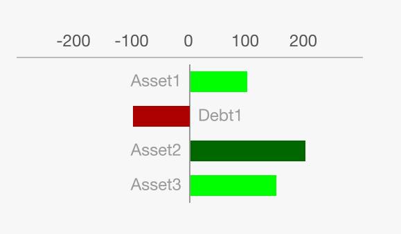

# Bar Charts

## Asset/Debt Bar Chart

The Asset/Debt bar chart has the axis line centered for showing both positive and negative values (such as showing a list of assets and debts).



### Basic use
Bare minimum, the data and width need to be set for the chart to render.

```jsx
render() {
  let chartData = [
    {
      label: "Asset1",
      value: 100,
    },
    {
      label: "Debt1",
      value: -100,
    },
    {
      label: "Asset2",
      value: 200,
    },
    {
      label: "Asset3",
      value: 150,
    },
  ]

  const chartProperties = {
    data: chartData,
    width: 250,
  }

  return (
    <View>
      <AssetDebtBarChart {...chartProperties} />
    </View>
  )
}
```

### Customizations

#### Colors
Colors can be customized by sending either an array of colors to rotate through, or colors attached specifically to the data. Color given through data will be used over other options.

**By Data**
```jsx
let chartData = [
  {
    label: "Asset1",
    value: 100,
    color: "#00F"
  },
  {
    label: "Debt1",
    value: -100,
    color: "#F00"
  },
  {
    label: "Asset2",
    value: 200,
    color: "#00F"
  },
  {
    label: "Asset3",
    value: 150,
    color: "#00F"
  },
]
```

**By Array**
```jsx
const chartProperties = {
  data: chartData,
  width: 250,
  positiveColors: ['#0F0','#0A0','#060'],
  negativeColors: ['#F00','#A00','#600'],
}
```

#### Bar Height, Spacing & Minimum width
The bar height, spacing and minimum width can be adjusted by properties.
```jsx
const chartProperties = {
  data: chartData,
  width: 250,
  barHeight: 20, //This is the height of the bar
  barGap: 15, //This is the space between bars
  barMinWidth: 5, //This is the minimum width for a bar (i.e. if you have a 0 value)
}
```

#### Scale
You can change the maximum value and increment of the scale if you want it to be set to a specific value. You can also specific an array for specific scale points. The scaleIncrement value would be ignored if scale is used.

**scaleMax/scaleIncrement**
```jsx
const chartProperties = {
  data: chartData,
  width: 250,
  scaleMax: 550, //This is the max value of the scale
  scaleIncrement: 250, //This is the increment amount. The scale will increment in this interval until it reaches the scale max (less than comparison). This example would be 0, 250 then 500. If scale max was 500, it would only be up 0 and 250.
}
```

**scale/scaleMax**
```jsx
const chartProperties = {
  data: chartData,
  width: 250,
  scale: [-300,-200,-100,0,100,200,300], //Specific scale points
  scaleMax: 400, //This is the max value of the scale
}

```

#### Scale Label Format
If you need special formatting on the scale labels (such as currency), you can customize this with a property.
```jsx
const chartProperties = {
  data: chartData,
  width: 250,
  scaleLabelFormat: (value) => {
    var start = '$'
    if (value < 0) {
      start = '-$'
    }

    var n = Math.abs(value)

    return start + n.toString();
  },
}
```
